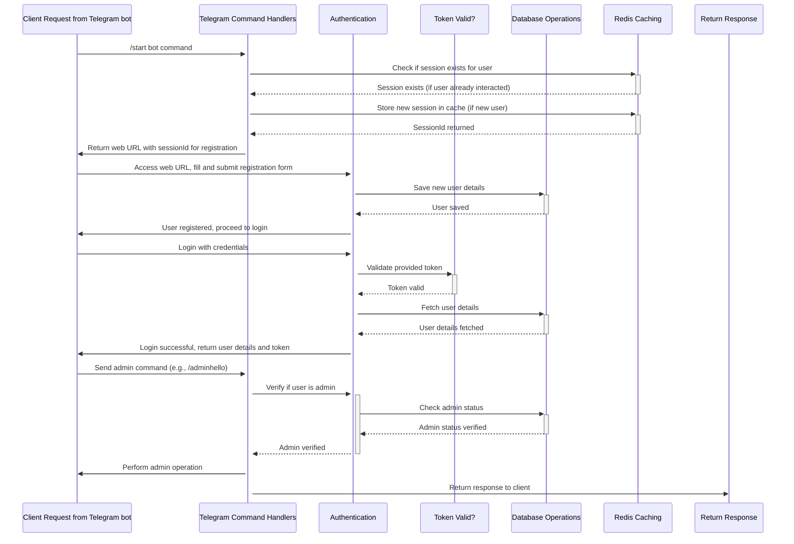

# Orca Backend

This project, Orca Backend, is designed to provide backend services for the Orca application. It's built with Node.js and TypeScript, leveraging Express for the server framework and MongoDB for data persistence. The application also integrates with Telegram for notifications, cloudflare image for image processing and Redis for caching.

## Technical Flow

Below is a simplified flowchart describing the technical flow of the Orca Backend:



This flowchart illustrates the process from receiving client requests, through authentication, database operations, and finally responding to the client. It also highlights the use of Telegram for notifications and Redis for caching within the application.

## Prerequisites

- Node.js 16+
- npm or Yarn
- MongoDB
- Redis

## Installation

1. Clone the repository:

```bash
git clone https://github.com/OladetounJed/orca-backend
Install dependencies:
Create and configure the .env file based on the .env.example template:
Start the application:
```

## Features
- User authentication and registration
- Session management
- Telegram notifications
- Data persistence with MongoDB
- Caching with Redis


## Contributing
Contributions are welcome! Please feel free to submit a pull request or open an issue.
